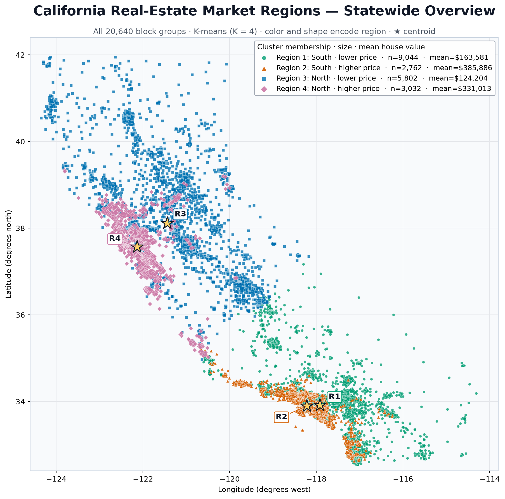
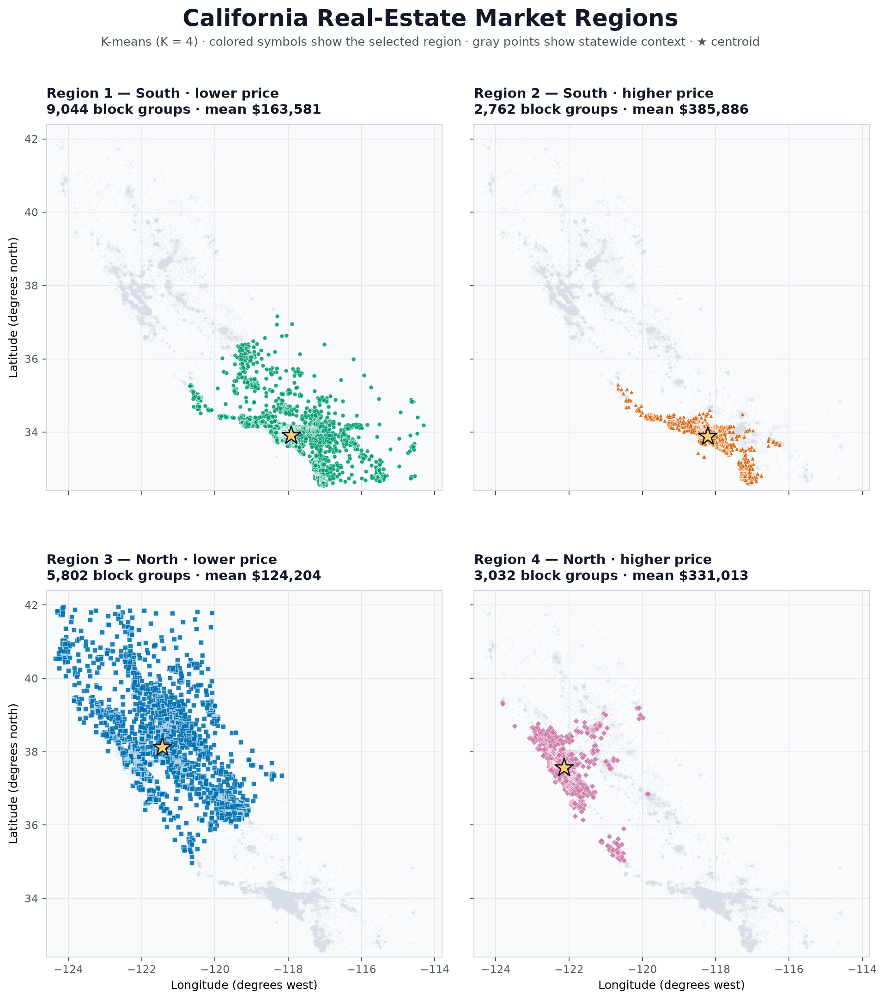

# Identifying California Real-Estate Market Regions Using K-Means Clustering

## Abstract

In this study, we use K-means clustering to divide California into a small number of interpretable real-estate market regions. We analyze 20,640 census block groups from the California Housing dataset using longitude, latitude, and median house value. After standardizing the three features, we compare candidate solutions with two through eight clusters and select a four-cluster model based on the reduction in within-cluster variation, diagnostic separation, and the need for a useful regional subdivision. The resulting clusters distinguish northern and southern California while also separating relatively high- and low-price markets within each broad geographic area. Mean house values range from approximately $124,204 in the northern lower-price region to $385,886 in the southern higher-price region. K-means provides a transparent exploratory segmentation, although it encourages geographic compactness rather than formally guaranteeing contiguous regions.

## 1. Introduction

Housing markets are shaped by both geography and price. Nearby communities often share access to employment centers, transportation systems, and local amenities, while substantial price differences can still occur within the same broad part of the state. A useful market segmentation should therefore account for spatial location and typical housing value simultaneously.

Our objective is to divide the California Housing observations into a small number of real-estate market regions that are geographically coherent and similar in median house value. We apply K-means clustering to three variables: longitude, latitude, and median house value. This approach provides a concise, reproducible summary of the dataset without requiring previously defined region labels.

## 2. Data

We use the California Housing dataset distributed through scikit-learn. The dataset contains 20,640 observations, each representing a census block group rather than an individual house. For every observation, we retain the following variables:

- `Longitude`: geographic longitude of the block group;
- `Latitude`: geographic latitude of the block group; and
- `MedHouseVal`: median house value, expressed in units of $100,000.

The resulting input is an \(n \times 3\) numerical matrix, where \(n=20{,}640\). For observation \(i\), the feature vector is

$$
x_i=(\text{longitude}_i,\text{latitude}_i,\text{median house value}_i).
$$

This is an unsupervised analysis. Unlike linear regression, no variable is designated as a response to be predicted. Instead, all three variables jointly define similarity among observations.

## 3. Methodology

### 3.1 Purpose and suitability of K-means

K-means is an unsupervised learning method that partitions observations into a prespecified number of groups. It is appropriate for our objective because each block group can be represented as a point with two spatial coordinates and one price coordinate. The method assigns observations with similar standardized feature values to the same cluster, producing a centroid that summarizes the typical location and median house value of each region.

The inclusion of longitude and latitude encourages geographically nearby observations to be grouped together. Including median house value simultaneously encourages economically similar observations to share a cluster. Consequently, the resulting groups represent a compromise between geographic proximity and price similarity.

K-means does not, however, enforce a formal spatial adjacency constraint. It favors compact groups in the selected feature space, but it cannot guarantee that every cluster forms one uninterrupted geographic area. We therefore interpret the results as exploratory market regions rather than official or strictly contiguous boundaries.

### 3.2 Standardization

K-means relies on Euclidean distance, which is sensitive to measurement units and numerical scale. Longitude and latitude are measured in degrees, whereas median house value is measured in units of $100,000. If we applied K-means directly to the unscaled variables, a feature with greater numerical variation could have a disproportionate influence on cluster assignment.

We standardize every feature before fitting the model:

$$
z_{ij}=\frac{x_{ij}-\bar{x}_j}{s_j},
$$

where \(\bar{x}_j\) and \(s_j\) are the sample mean and standard deviation of feature \(j\). Standardization gives each selected feature a mean of zero and a standard deviation of one, allowing longitude, latitude, and price to contribute on comparable numerical scales. This remains a modeling choice: one standard deviation does not necessarily have the same practical meaning for every variable.

### 3.3 Optimization problem

For a selected number of clusters \(K\), K-means partitions the standardized observations into non-overlapping sets \(C_1,\ldots,C_K\). Each cluster has a centroid \(\mu_k\). The method minimizes the within-cluster sum of squared Euclidean distances:

$$
\min_{C_1,\ldots,C_K,\,\mu_1,\ldots,\mu_K}
\sum_{k=1}^{K}\sum_{i\in C_k}\lVert z_i-\mu_k\rVert_2^2.
$$

This objective, also called inertia, rewards clusters whose observations are close to their centroids. Because distance is squared, unusually distant observations receive greater weight in the objective.

### 3.4 Estimation algorithm

We use Lloyd's algorithm with k-means++ initialization:

1. Select \(K\) initial centroids. K-means++ spreads the initial centroids across the feature space to reduce the likelihood of a poor starting configuration.
2. Assign every observation to the nearest centroid using squared Euclidean distance.
3. Update each centroid to equal the coordinate-wise mean of all observations assigned to that cluster.
4. Repeat the assignment and update steps until cluster membership stabilizes, the improvement falls below the convergence tolerance, or the iteration limit is reached.

Each iteration cannot increase the objective function, so the algorithm converges. Nevertheless, it can converge to a local rather than global minimum. We address this sensitivity by fitting 20 initializations and retaining the solution with the smallest inertia. We set `random_state=42` to ensure reproducibility.

### 3.5 Hyperparameter selection

The primary hyperparameter is the number of clusters, \(K\). We compare candidate models for \(K=2,\ldots,8\) using inertia and the silhouette coefficient. The silhouette coefficient compares each observation's cohesion within its assigned cluster with its separation from the nearest alternative cluster. Larger values indicate better-separated groups.

| \(K\) | Inertia | Silhouette coefficient |
|---:|---:|---:|
| 2 | 26,768.4 | 0.545 |
| 3 | 18,289.0 | 0.529 |
| 4 | 12,109.4 | 0.490 |
| 5 | 9,863.6 | 0.472 |
| 6 | 8,113.9 | 0.415 |
| 7 | 6,563.2 | 0.410 |
| 8 | 5,796.4 | 0.395 |

Inertia necessarily decreases as \(K\) increases, so we focus on the magnitude of improvement rather than the smallest raw value. The silhouette results favor a coarser two-cluster solution, but the project objective also calls for a useful subdivision into a small number of real-estate regions. We select \(K=4\) because it substantially reduces inertia relative to the two- and three-cluster solutions while remaining sufficiently compact for interpretation. This choice balances statistical separation with the substantive goal of distinguishing both geography and price levels.

## 4. Results

### 4.1 Statewide cluster structure

Figure 1 presents all 20,640 observations in a common coordinate system. Color and marker shape identify cluster membership, and stars indicate cluster centroids. We relabel the arbitrary K-means cluster identifiers in a stable, interpretable order: southern regions first, followed by northern regions, with the lower-price region preceding the higher-price region within each broad geographic area.



The combined map shows a strong north-south division together with a price-based split inside each broad geographic area. The higher-price clusters concentrate more heavily along coastal markets, whereas the lower-price clusters extend farther inland.

### 4.2 Region-specific maps

Because clusters based partly on price can occupy overlapping geographic areas, Figure 2 displays the same assignments in four panels. Each panel highlights one region while retaining the full state as a faint reference layer. This view makes the geographic distribution of every cluster visible without hiding observations behind other colors.



### 4.3 Regional summary

| Region | Interpretation | Block groups | Mean `MedHouseVal` | Approximate mean price |
|---:|---|---:|---:|---:|
| 1 | Southern, lower-price | 9,044 | 1.636 | $163,581 |
| 2 | Southern, higher-price | 2,762 | 3.859 | $385,886 |
| 3 | Northern, lower-price | 5,802 | 1.242 | $124,204 |
| 4 | Northern, higher-price | 3,032 | 3.310 | $331,013 |

Regions 1 and 2 have similar mean latitudes but markedly different mean house values. Region 2 captures higher-price portions of Southern California, particularly coastal markets, while Region 1 contains a broader lower-price southern market. The northern observations exhibit a comparable division. Region 4 is concentrated near higher-price coastal and Bay Area locations, whereas Region 3 extends across a much larger portion of inland and northern California.

The lowest mean value occurs in Region 3 at approximately $124,204, and the highest occurs in Region 2 at approximately $385,886. These results suggest that the clustering captures both large-scale geography and the coastal-versus-inland price contrast.

## 5. Discussion and limitations

The four-cluster model provides an interpretable segmentation of a large dataset using only three variables. Standardization ensures that the solution reflects all selected features rather than being dominated by their original units. Repeated k-means++ initialization also reduces sensitivity to an unfavorable starting configuration.

Several limitations should guide interpretation. First, K-means encourages geographic compactness but does not enforce connected regions. A cluster may therefore contain separated pockets with similar standardized locations and prices. Second, K-means favors approximately spherical groups under Euclidean distance, while the geography of California is elongated and housing markets can have irregular shapes. Third, the California Housing target variable is top-coded at the expensive end, which compresses variation among the highest-value observations. Finally, the three-feature model omits factors such as income, housing density, employment access, and local amenities. The identified regions summarize patterns in the selected data; they do not establish causal explanations for house prices.

A spatially constrained clustering method would be an appropriate extension if strict geographic contiguity were essential. Alternative approaches could also assess robustness to different feature weights or incorporate additional housing-market variables.

## 6. Conclusion

We used standardized longitude, latitude, and median house value to organize 20,640 California census block groups into four broad real-estate market regions. The resulting segmentation identifies lower- and higher-price markets within both Southern and Northern California. Mean prices differ substantially across the regions, ranging from approximately $124,204 to $385,886.

K-means is well suited to this exploratory objective because its purpose, distance measure, and centroid summaries are transparent. The method produces a concise and reproducible statewide overview while revealing the central role of both geography and price. Its principal limitation is that geographic continuity is encouraged but not guaranteed, so the clusters should be viewed as data-driven market segments rather than formal administrative boundaries.

## Appendix A. Full reproducible code

```python
import pandas as pd
import matplotlib.pyplot as plt
from pathlib import Path
from sklearn.cluster import KMeans
from sklearn.datasets import fetch_california_housing
from sklearn.metrics import silhouette_score
from sklearn.preprocessing import StandardScaler

# Load the dataset and retain the three required variables.
data = fetch_california_housing(as_frame=True)
df = data.frame.copy()
feature_names = ["Longitude", "Latitude", "MedHouseVal"]
X = df[feature_names].dropna().copy()

# Standardize the features used in Euclidean distance calculations.
scaler = StandardScaler()
X_scaled = scaler.fit_transform(X)

# Compare candidate values of K.
diagnostics = []
for k in range(2, 9):
    candidate = KMeans(
        n_clusters=k,
        init="k-means++",
        n_init=20,
        random_state=42,
    )
    candidate_labels = candidate.fit_predict(X_scaled)
    diagnostics.append(
        {
            "K": k,
            "Inertia": candidate.inertia_,
            "Silhouette": silhouette_score(
                X_scaled,
                candidate_labels,
                sample_size=5000,
                random_state=42,
            ),
        }
    )

diagnostics = pd.DataFrame(diagnostics)
print(diagnostics.round({"Inertia": 1, "Silhouette": 3}))

# Fit the selected model.
model = KMeans(
    n_clusters=4,
    init="k-means++",
    n_init=20,
    random_state=42,
)
raw_labels = model.fit_predict(X_scaled)

# Relabel the clusters for stable reporting.
centers_original = pd.DataFrame(
    scaler.inverse_transform(model.cluster_centers_),
    columns=feature_names,
)
south = centers_original.nsmallest(2, "Latitude").sort_values("MedHouseVal")
north = centers_original.nlargest(2, "Latitude").sort_values("MedHouseVal")
ordered_raw_labels = list(south.index) + list(north.index)
label_map = {
    raw_label: region
    for region, raw_label in enumerate(ordered_raw_labels, start=1)
}
X["Region"] = pd.Series(raw_labels, index=X.index).map(label_map)

# Calculate regional summary statistics.
region_summary = X.groupby("Region").agg(
    Block_groups=("MedHouseVal", "size"),
    Mean_longitude=("Longitude", "mean"),
    Mean_latitude=("Latitude", "mean"),
    Mean_MedHouseVal=("MedHouseVal", "mean"),
)
region_summary["Approx_mean_price_USD"] = (
    region_summary["Mean_MedHouseVal"] * 100_000
).round().astype(int)
print(region_summary.round(3))

# Define consistent region colors and marker shapes.
styles = {
    1: {"name": "South · lower price", "color": "#009E73", "marker": "o"},
    2: {"name": "South · higher price", "color": "#D55E00", "marker": "^"},
    3: {"name": "North · lower price", "color": "#0072B2", "marker": "s"},
    4: {"name": "North · higher price", "color": "#CC79A7", "marker": "D"},
}

figure_dir = Path("figures")
figure_dir.mkdir(exist_ok=True)

# Create the combined statewide map.
fig, ax = plt.subplots(figsize=(11.5, 9.5))
ax.set_facecolor("#F8FAFC")
for region in [3, 1, 4, 2]:
    style = styles[region]
    subset = X[X["Region"] == region]
    summary = region_summary.loc[region]
    ax.scatter(
        subset["Longitude"],
        subset["Latitude"],
        s=13 if region in (1, 3) else 17,
        color=style["color"],
        marker=style["marker"],
        alpha=0.78 if region in (1, 3) else 0.90,
        edgecolors="white",
        linewidths=0.2,
        label=(
            f"Region {region}: {style['name']} · "
            f"n={int(summary['Block_groups']):,} · "
            f"mean=${summary['Approx_mean_price_USD']:,.0f}"
        ),
    )

for region in range(1, 5):
    center = region_summary.loc[region]
    ax.scatter(
        center["Mean_longitude"],
        center["Mean_latitude"],
        marker="*",
        s=300,
        color="#FFD166",
        edgecolors="#111827",
        linewidths=1.25,
        zorder=10,
    )

ax.set(
    xlim=(-124.6, -113.8),
    ylim=(32.4, 42.4),
    xlabel="Longitude (degrees west)",
    ylabel="Latitude (degrees north)",
    title="California Real-Estate Market Regions — Statewide Overview",
)
ax.set_aspect("equal", adjustable="box")
ax.grid(alpha=0.2)
ax.legend(title="Cluster membership · size · mean house value")
fig.tight_layout()
fig.savefig(
    figure_dir / "california_kmeans_combined.png",
    dpi=190,
    bbox_inches="tight",
)
plt.show()

# Create four region-specific panels.
fig, axes = plt.subplots(
    2,
    2,
    figsize=(11, 12.5),
    sharex=True,
    sharey=True,
)
for ax, (region, style) in zip(axes.flat, styles.items()):
    subset = X[X["Region"] == region]
    center = region_summary.loc[region]
    ax.scatter(
        X["Longitude"],
        X["Latitude"],
        s=4,
        color="#D8DEE6",
        alpha=0.24,
        linewidths=0,
    )
    ax.scatter(
        subset["Longitude"],
        subset["Latitude"],
        s=13,
        color=style["color"],
        marker=style["marker"],
        alpha=0.88,
        edgecolors="white",
        linewidths=0.22,
    )
    ax.scatter(
        center["Mean_longitude"],
        center["Mean_latitude"],
        marker="*",
        s=270,
        color="#FFD166",
        edgecolors="#111827",
        linewidths=1.15,
    )
    ax.set_title(
        f"Region {region} — {style['name']}\n"
        f"{int(center['Block_groups']):,} block groups · "
        f"mean ${center['Approx_mean_price_USD']:,.0f}",
        loc="left",
    )
    ax.set_xlim(-124.6, -113.8)
    ax.set_ylim(32.4, 42.4)
    ax.set_aspect("equal", adjustable="box")
    ax.grid(alpha=0.2)

for ax in axes[:, 0]:
    ax.set_ylabel("Latitude (degrees north)")
for ax in axes[-1, :]:
    ax.set_xlabel("Longitude (degrees west)")

fig.suptitle("California Real-Estate Market Regions", fontsize=20)
fig.subplots_adjust(
    top=0.875,
    bottom=0.065,
    left=0.08,
    right=0.98,
    hspace=0.24,
    wspace=0.08,
)
fig.savefig(
    figure_dir / "california_kmeans_regions.png",
    dpi=180,
    bbox_inches="tight",
)
plt.show()
```
